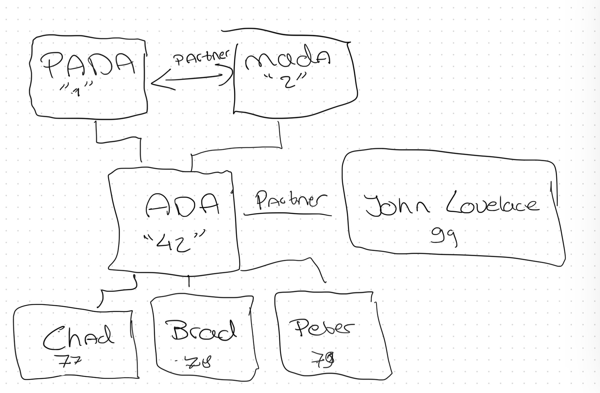
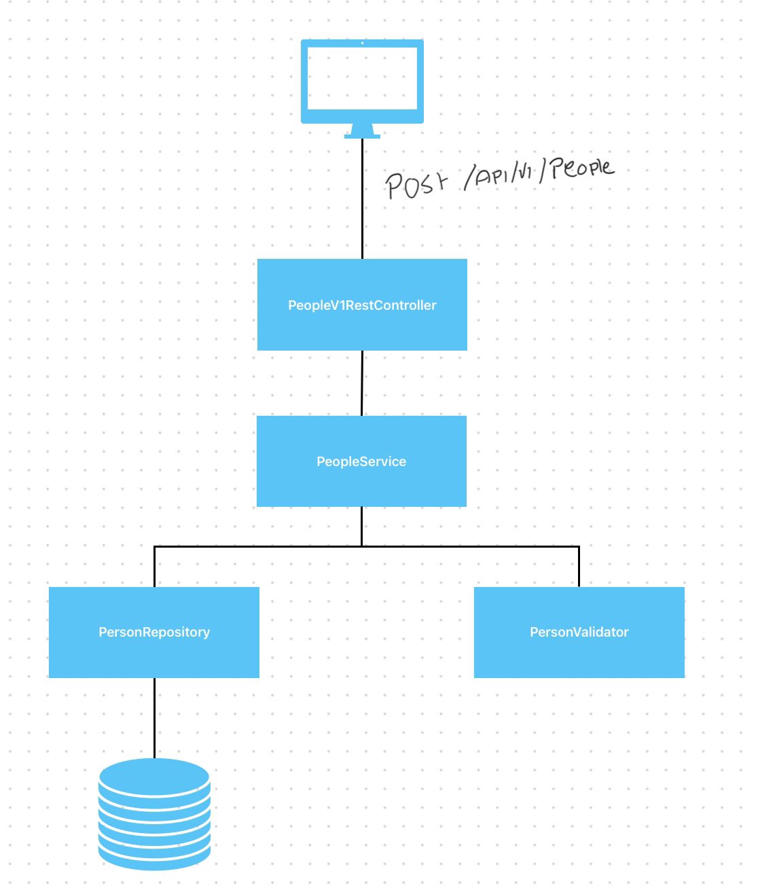

# Three Kid Family Challenge
Dear reader. Welcome. 

This is the implementation of the Three Kid Family Challenge.
As my Git commit is probably showing, it went with ups and downs.

## Getting Started

1. Install all the packages.
```shell
mvn clean install
````
2. Run the application. You can also use the run configuration attached in the .run folder.
```shell
mvn spring-boot:run
```
3. You probably want to check if it works. You can fire all the requests for creating a happy family by using the [happy-family-requests.http](src/main/resources/happy-family-requests.http) file.

## Situation



I chose to use the situation as sketched above. I understand that this is the ultimate happy flow, but for time purposes this was fun enough. 
The flow picked up by the application is as followed
- A POST call is being done to endpoint: "/api/v1/people"
- The Person who has been offered will be saved or updated.
  - The service will call the mapper who then will handle the corresponding mapping. 
    - I lost a lot of time while trying to make the "perfect" entity relations. Getting Bidirectional partners was not a fun thing for Hibernate.
    - Chose to use Ids and do a lookup later in the process. (Maybe this falls under the "don't do when statements").
    - Ideally I don't want to give a mapper access to the Repository layer, but for now this is the quick and easy solution.
  - After that the validation will be done. 
    - The Entities are kept stupid. The domain should handle any logic.
    - The PersonValidator class handles all the validation, but delegates everything to the Person class.



## Next Steps
- I like to work BDD. Add some cucumber scenario's to test the application on a functional level.
  - The current RestControllerTest is doing that for me now, but is not the cleanest solution. 
- TestCoverage can be much better. I've done some tests to show how easy the testability is now because I've separated a lot of classes.
  - Is this much separation easy to read? I don't know. I'm very curious how you would have done it. 
  - I skipped the Integration test (started with the @WebMVC test) and mocked all the services/repos. Choose to migrate to SpringBootTest to get a better scenario for quick fixing.
- I will try to do a sketchy Async solution for the API call. 
  - Chose to not use Async from the beginning, since that has been a while. Used the Vert.X framework before. 
  - Testability is harder while using Async. Given the limited amount of hours, this would be something I would pick up from the beginning in a "real" project.
- Error handling and logging
  - Currently none. Was planning on doing that, but taking time for the small necessities was costing me valuable time.
  - I like to work with explicit exceptions. During the validation phase I could use explicit exceptions to give more feedback on what validation is failing. 
    - Then use a ControllerAdvice to handle them centrally.

## Lessons Learned
- I know myself as a "quickfixer". When I have the domain in my head its on paper fast. 
  - Now the domain was new, reading is sometimes difficult, so you can imagine that I could have been more secure. 
  - Was fun, since being on a project for a few years, this challenged me to really go back to the baby steps. 
- I went with the "easy" usage of Id's in the DB. But this brought me back to school. Database design and integration with an ORM was not my strongest point.
  - Getting errors while implementing a Bidirectional @OneToOne gave me huge imposter syndrome.
- Probably a lot more ;-)

## Questions for the reader
- It has been a while since my code has been properly reviewed. Being a lead on an assignment makes a lot of people think: "Ah will be ok if he did it."
  - Curious what I can improve! But please be gentle. 
- What kind of architecture do you use? I'm a little bit three tier in this example. 
- How far do you go up the test pyramid? Is my wish for BDD something you can agree with?
- I'm not an active design pattern practitioner. Code should be simple and straightforward, but I probably could have used some nice ones. What is your opinion on the matter?


